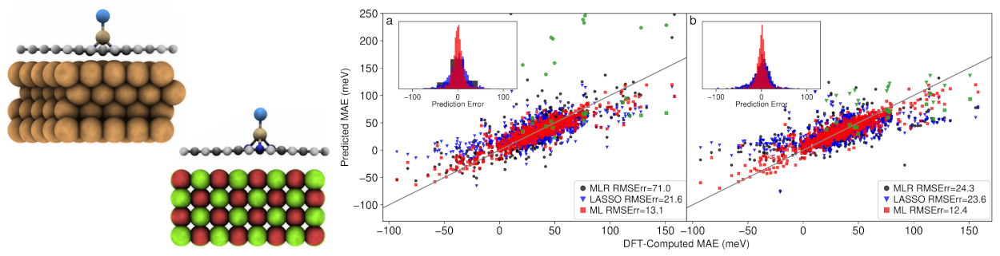

# Interpretable machine learning for atomic scale magnetic anisotropy in quantum materials
This repository contains the codebase and datasets associated with the article

*Interpretable machine learning for atomic scale magnetic  anisotropy in quantum materials*, 

by: Jan Navrátil, Rafał Topolnicki, Michal Otyepka and Piotr Błoński

enabling the reproduction of key results of the paper. 

## Repository structure
Most of the codebase is provided as notebooks, which include comments and references linking directly to specific parts of the manuscript 
and suplementary information.

* `data`: Contains the complete dataset used to train the machine learning models.
* `code/src`: Includes additional code to be imported
* `results`: Stores all generated outputs. These files can be used to reproduce the figures and tables presented in the manuscript.

## Notebooks & script to reproduce results
The main directory includes the `code/TrainModels.py` script, which can be run to reproduce all the paper's main results.  
This script is a 1:1 copy of the [TrainModels.ipynb](code/TrainModels.ipynb) notebook. 
You can use one or another, but for a better experience, we recommend using a notebook

The main directory includes the following notebooks:
* [TrainModels.ipynb](code/TrainModels.ipynb): Reproduces the main results in the manuscript:
  * Tables: Table 1, Table 2
  * Figures (from the generated output): Figure 2, Figure 3, Figure S3, and Figure S4
  * Feature selection
  * SOC energy predictions
* [CorrelationMatrix.ipynb](code/CorrelationMatrix.ipynb): Reproduces correlation matrices:
  * Figure 1: Spearman’s correlation matrix
  * Figure S1: Kendall’s correlation coefficients
  * Figure S2: Pearson’s correlation coefficients
* [TrainModels_predict_PT.ipynb](code/TrainModels_predict_PT.ipynb): Reproduces additional experiments using second-order perturbation theory (PT) as the target variable instead of MAE:
  * Reproduces supplementary results, e.g., Figure S7
* [TrainModels_PT_as_feature.ipynb](code/TrainModels_PT_as_feature.ipynb): Explores the use of PT values as input features in the model
